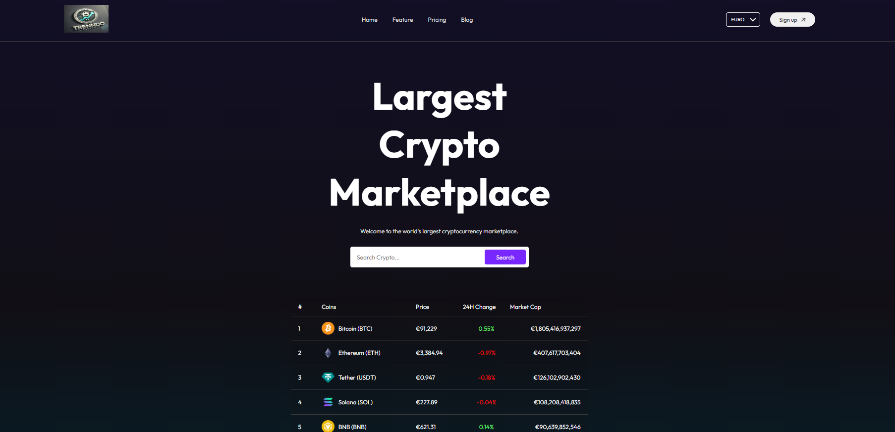
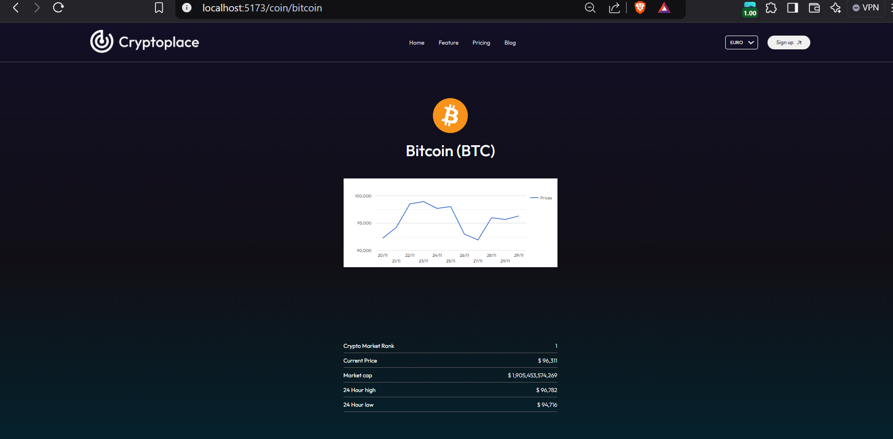

# React + Vite Cryptocurrency Tracker

This project is a cryptocurrency tracker built using React and Vite. It fetches cryptocurrency price exchange rates and charts using the [CoinGecko API](https://www.coingecko.com/). The app provides real-time data on cryptocurrency prices and displays interactive charts for better data visualization.

## Features

- Fetch real-time cryptocurrency price exchange rates
- Display cryptocurrency price charts
- Built with React and Vite for fast development and efficient performance
- Responsive design for mobile and desktop

## Technologies Used

- **React**: A JavaScript library for building user interfaces.
- **Vite**: A build tool that provides a faster and leaner development experience.
- **CoinGecko API**: A free API that provides real-time cryptocurrency data, including prices, historical data, and market statistics.

## API Key

The CoinGecko API does not require an API key for basic usage. However, if you want to access more advanced features or rate-limited endpoints, you may need to sign up for an API key.

### How to Get the API Key:

1. Visit [CoinGecko API](https://www.coingecko.com/en/api) to view the available endpoints and get details on how to sign up for an API key.
2. Once registered, you will receive an API key that can be added to your project for making authenticated requests.

### API Usage in the Project:

In this project, the CoinGecko API is used to fetch cryptocurrency price exchange rates and charts. The API requests are made in two key files: `coin.jsx` and `coincontext.jsx`.

- **coin.jsx**: This file contains the logic for fetching cryptocurrency data using the CoinGecko API. The API requests are structured here, and the data is processed and returned for display.
- **coincontext.jsx**: This file manages the state for the cryptocurrency data and provides the context to other components. It fetches the data from `coin.jsx` and provides it to the rest of the app using React Context.

If you want to use your own CoinGecko API key or modify the API requests, you can do so in these two files.

## Installation

### Prerequisites

- Node.js (v16 or higher)
- npm or yarn

### Steps to run the project locally:

1. Clone the repository:
   ```bash
   git clone <repository-url>
   ```

## LIVE WEBSITE
https://crypto-trend.vercel.app/

## Screenshot




